<div align="center">

# 📰 AI Newsdeck

**An AI agent that monitors the news for you.**
Give it keywords. It plans the search, judges the results, summarizes every article with Claude, and organizes everything into a live dashboard, then keeps it fresh every hour.


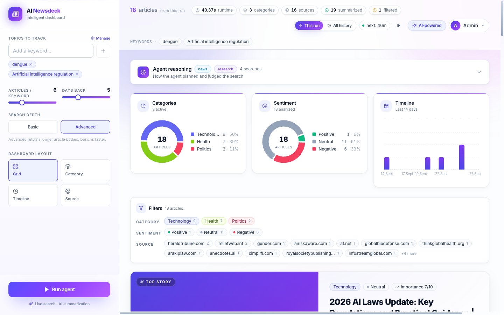

</div>

---

## Table of contents

- [What it does](#what-it-does)
- [Screenshots](#screenshots)
- [The AI agent](#the-ai-agent)
- [Architecture](#architecture)
- [Tech stack](#tech-stack)
- [Quick start (Docker)](#quick-start-docker)
- [Local development](#local-development)
- [Configuration](#configuration)
- [API reference](#api-reference)
- [Data model](#data-model)
- [Production deployment](#production-deployment)
- [Project structure](#project-structure)
- [Troubleshooting](#troubleshooting)
- [Roadmap](#roadmap)

---

## What it does

| | |
|---|---|
| 🧠 **Agentic search** | Claude classifies each keyword (breaking news vs. research vs. entity lookup), writes optimized search queries, judges whether the results are on-topic, and retries with a new angle when they aren't. |
| 📝 **Structured summaries** | Every article becomes a 2–3 sentence summary, 3–5 key points, a category, sentiment, an importance score (1–10), a relevance score (0–10) and tags. |
| 🧹 **Noise filtering** | Duplicate URLs are removed and off-topic articles (relevance < 4) are dropped before you ever see them. |
| 📊 **Dashboard** | Category, sentiment and timeline charts; filters; a featured top story; four layouts (Grid, Category, Timeline, Source). |
| ⏰ **Scheduled monitoring** | A background scheduler re-runs the agent over all active keywords every hour and stores new articles. |
| 🔐 **Accounts & roles** | Email/password auth with JWT, password reset, and an admin role for managing tracked keywords. |
| 💾 **Persistence & caching** | Articles in PostgreSQL (or SQLite); summaries cached in Redis so the same URL is never paid for twice. |

---

## Screenshots

### Landing page
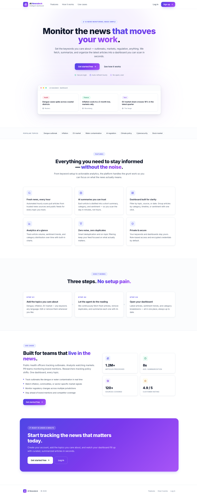

### Authentication

| Sign in | Sign up | Forgot password |
|---|---|---|
| 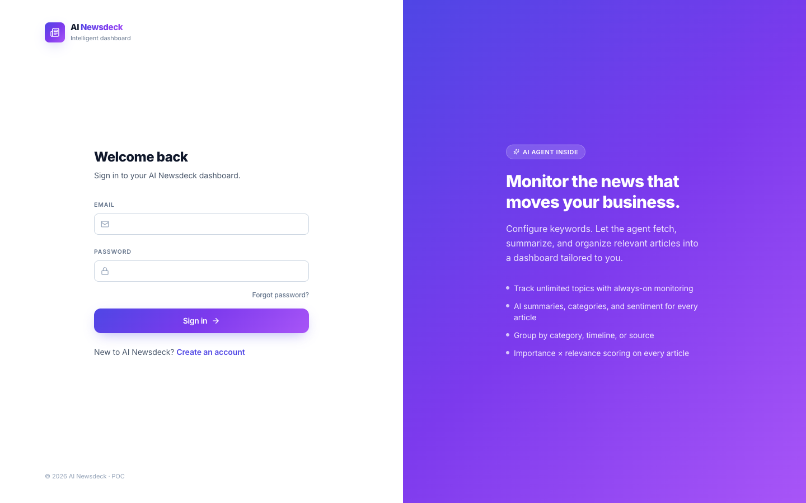 | 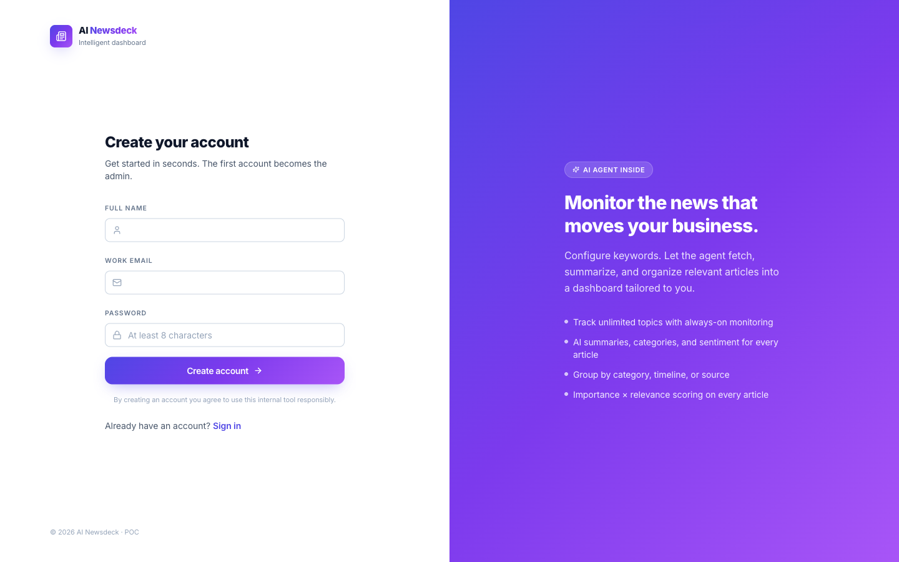 | 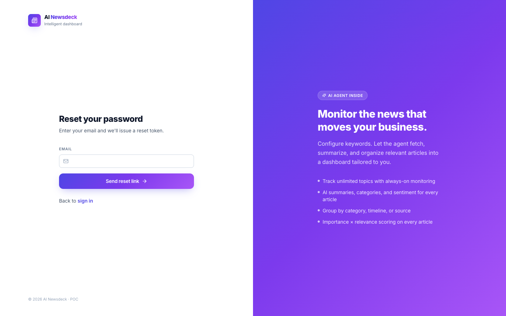 |

### Dashboard: run results, analytics & filters
Run stats (runtime, sources, summarized vs. filtered), category and sentiment donuts, a publish-date timeline, and filter chips.


### AI agent at work
While the agent runs, the dashboard shows live progress:

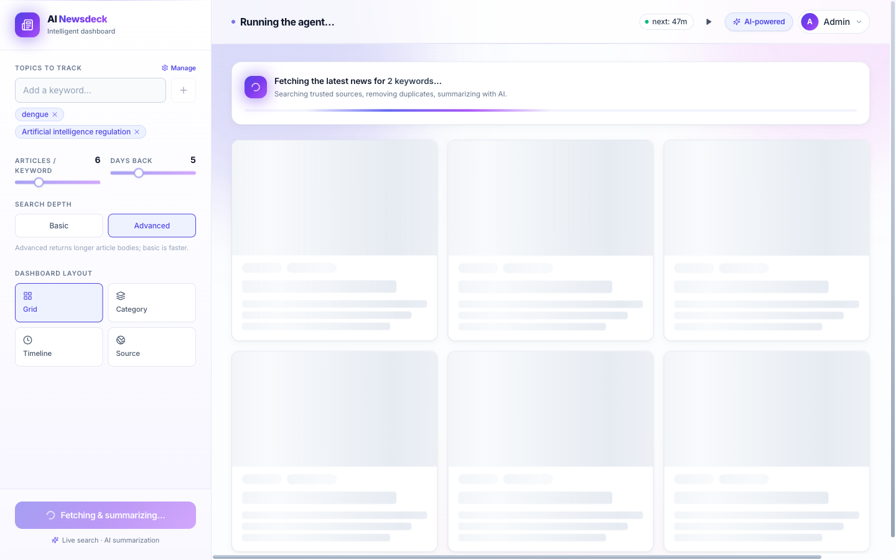

### Agent reasoning trace
Every run exposes **how the agent thought**: the plan Claude chose for each keyword (intent, index, time window, queries), each search and its hit count, and the evaluator's verdict with its reasoning.

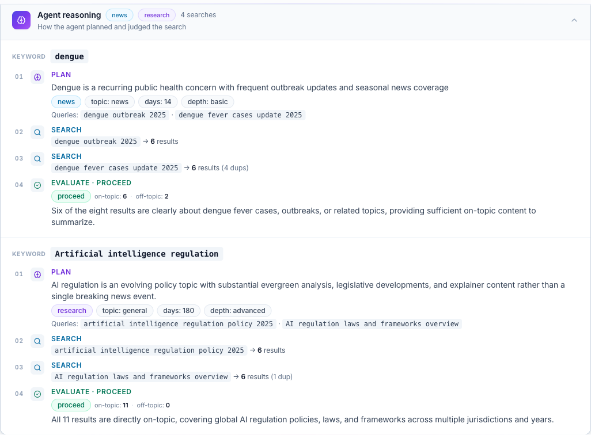

### Dashboard layouts

| Grid | By category |
|---|---|
| 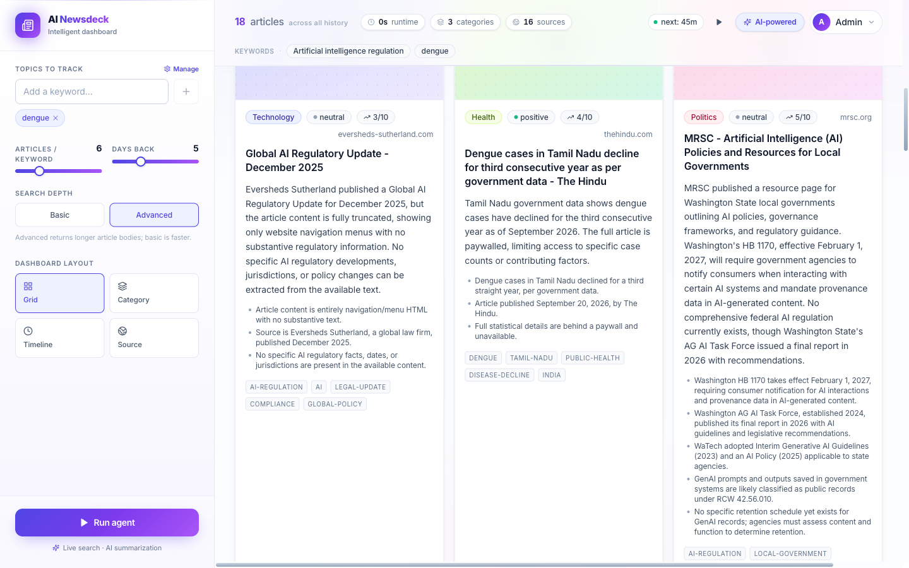 | 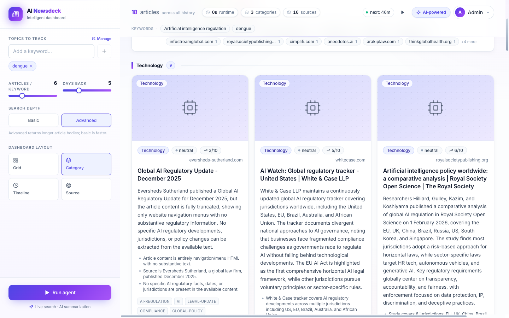 |
| **Timeline** | **By source** |
| 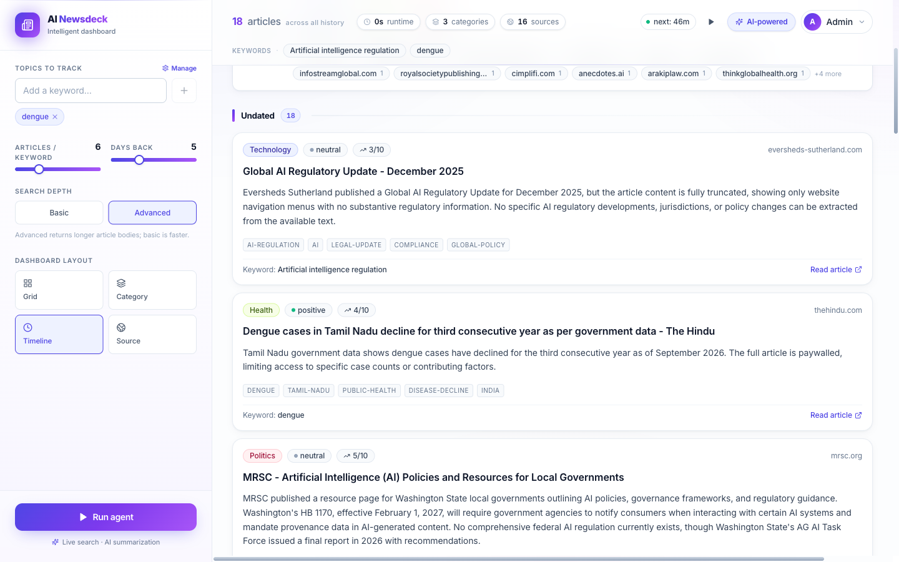 | 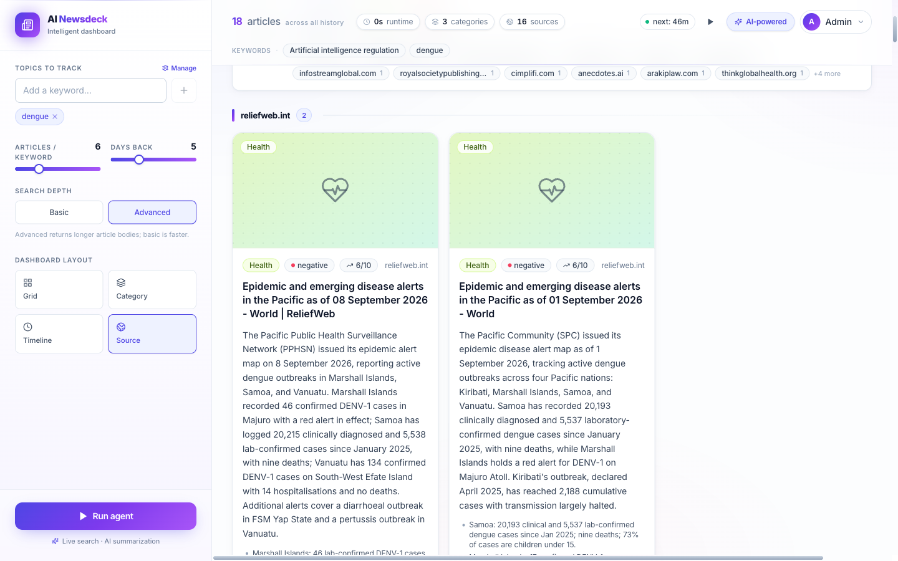 |

### Keyword management (admin)
Admins add, rename, pause and delete the keywords the hourly scheduler tracks.

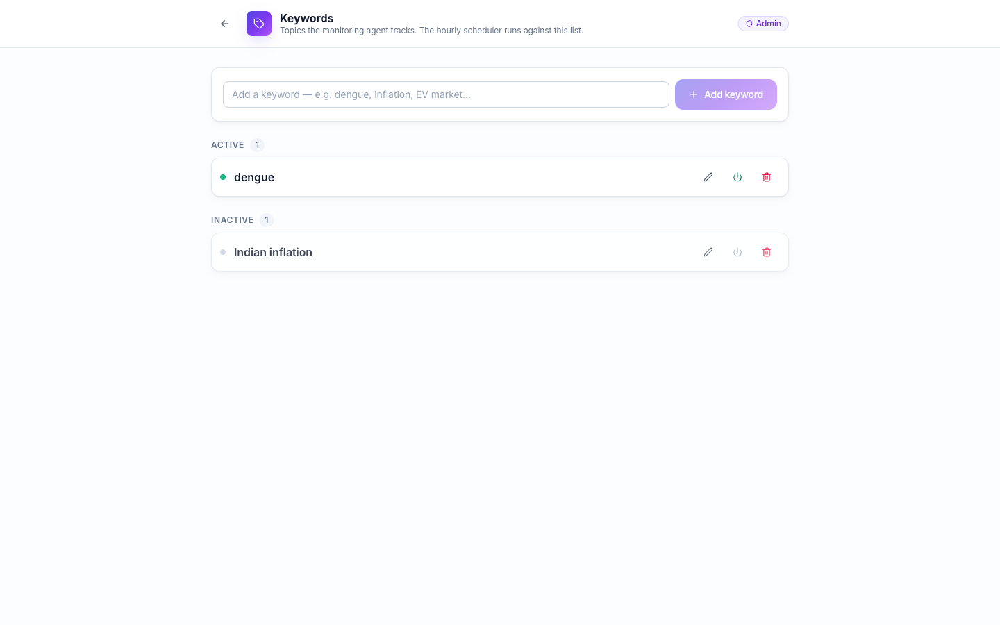

### Mobile

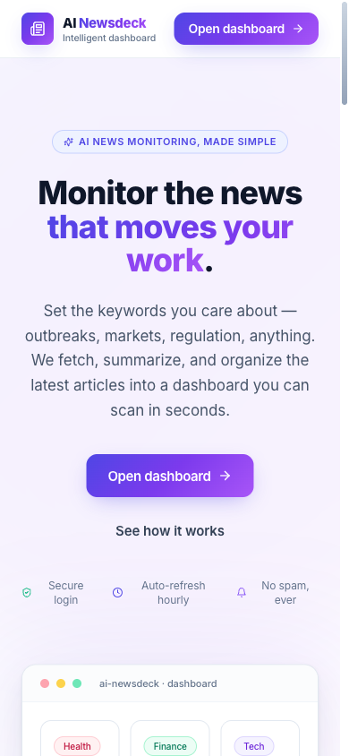

---

## The AI agent

The core of Newsdeck is a **LangGraph state machine** (`backend/app/services/agent.py`). Claude doesn't just summarize at the end; it makes decisions *during* the search.

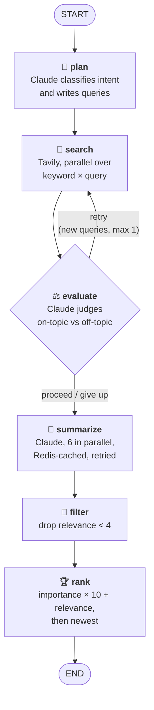

### Node by node

| Node | Who decides | What happens |
|---|---|---|
| **plan** | Claude | Classifies each keyword as **news** (current events → Tavily `news` index, 3–14 days), **research** (reviews/explainers → `general` index, 90–365 days) or **entity** (a person/company/product → `general`, 30–180 days). Fixes typos, adds disambiguators, and emits 1–2 optimized queries. All keywords are planned in parallel. |
| **search** | Tavily | Runs every *(keyword, query)* pair concurrently with full article bodies (`include_raw_content`). Results are de-duplicated by URL hash across keywords and queries. |
| **evaluate** | Claude | Reads the result titles and counts on-topic vs. off-topic. Decides **proceed** (≥ 2 good results), **retry** (suggests *new* queries from a different angle) or **give_up**. Retries loop back to `search` (max 2 attempts per keyword). |
| **summarize** | Claude | Produces strict JSON per article: `summary`, `key_points`, `category`, `sentiment`, `importance`, `relevance`, `tags`. Concurrency-limited (default 6), retried with exponential backoff via `tenacity`, and cached in Redis by URL. |
| **filter** | Rules | Drops articles with `relevance < RELEVANCE_THRESHOLD` (default 4). |
| **rank** | Rules | Sorts by `importance × 10 + relevance`, then by publish date. Results are persisted to the database. |

Each node appends to a **trace**, which the UI renders as the *Agent reasoning* panel. You can always see why an article was (or wasn't) included.

### Summarization prompt

The summarizer (`backend/app/services/llm_service.py`) is a strict JSON-output prompt with:

- **Category taxonomy:** Business, Technology, Politics, Sports, Entertainment, Science, World, Health, Finance, Other
- **Importance rubric (1–10):** conservative by default (4–6); 9–10 reserved for major global events
- **Sentiment:** the tone of the *event for those affected*, not the model's opinion
- **Relevance (0–10):** how directly the article addresses the search keyword; drives filtering

### Two ways the agent runs

1. **On demand:** a signed-in user adds keywords in the sidebar and clicks **Run agent** (`POST /api/news/fetch`).
2. **On a schedule:** APScheduler runs inside the API process and, every `SCHEDULER_INTERVAL_MINUTES`, picks up to `SCHEDULER_MAX_KEYWORDS_PER_RUN` active keywords (least recently fetched first), runs the agent, and logs the run to the `fetch_runs` audit table. A lock prevents overlapping runs; admins can trigger one with **Run now**.

---

## Architecture

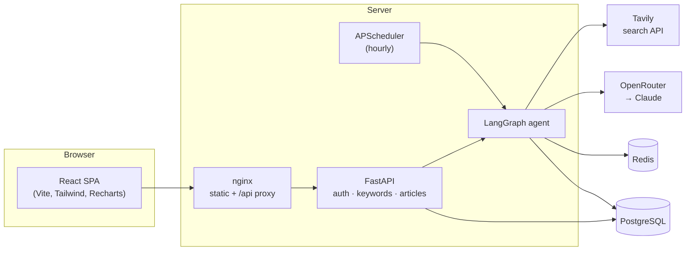

---

## Tech stack

| Layer | Technology |
|---|---|
| **Frontend** | React 18, TypeScript, Vite 5, Tailwind CSS 3, React Router 6, Recharts, lucide-react |
| **Backend** | FastAPI, Uvicorn, Pydantic v2, pydantic-settings |
| **Agent** | LangGraph, OpenAI-compatible SDK → OpenRouter → Claude Sonnet 4.6, tenacity |
| **Search** | Tavily Search API (`news` and `general` indexes, full-body extraction) |
| **Data** | SQLAlchemy 2 (async), PostgreSQL via asyncpg, or SQLite via aiosqlite |
| **Cache** | Redis (optional, fails open) |
| **Scheduling** | APScheduler (in-process `AsyncIOScheduler`) |
| **Auth** | bcrypt password hashing, JWT (python-jose) |
| **Ops** | Docker, Docker Compose, nginx, GitHub Actions CI, `uv` for Python deps |

---

## Quick start (Docker)

The fastest way to run the whole stack (Postgres, Redis, API and UI):

```bash
git clone https://github.com/Prashanth-TechAI/AI-Newsdeck.git
cd AI-Newsdeck

cp .env.example .env
# Edit .env and set at least:
#   OPENROUTER_API_KEY, TAVILY_API_KEY
#   JWT_SECRET  → python -c "import secrets; print(secrets.token_urlsafe(64))"

docker compose up -d --build
```

Open **http://localhost:8080**, click **Sign up**, and create your account.
**The first account created becomes the admin.**

```bash
docker compose logs -f backend   # watch the agent work
docker compose down              # stop (data is kept in volumes)
docker compose down -v           # stop and delete all data
```

> Compose runs with `APP_ENV=production` by default, so `JWT_SECRET` **must** be changed from the default or the API will refuse to start.

---

## Local development

**Prerequisites:** Python 3.10+ with [`uv`](https://docs.astral.sh/uv/), Node.js 20+, and PostgreSQL (or use SQLite). Redis is optional.

### 1. Configure

```bash
cp .env.example .env
# set OPENROUTER_API_KEY and TAVILY_API_KEY
# for SQLite instead of Postgres:  DATABASE_URL=sqlite:///./app.db
```

### 2. Backend (http://localhost:8000)

```bash
cd backend
uv sync
uv run uvicorn app.main:app --reload --port 8000
# or: ./run.sh
```

Tables are created automatically on startup. Interactive API docs: **http://localhost:8000/docs**

### 3. Frontend (http://localhost:5173)

```bash
cd ui
npm install
npm run dev
```

Vite proxies `/api` to `http://localhost:8000`, so there is no CORS setup in development.

### 4. Use it

1. Sign up (first user = admin).
2. Add 1–10 keywords in the sidebar, or click a trending topic.
3. Tune **articles per keyword** (3–15), **days back** (1–14) and **search depth** (basic/advanced).
4. Click **Run agent**, then explore the results, the agent trace, filters and layouts.
5. Toggle **This run / All history** to switch between the latest run and everything stored.
6. Admins: **Manage** → add keywords for the hourly scheduler.

---

## Configuration

All settings are read from `.env` at the repo root (see [`.env.example`](.env.example) for the full annotated list).

| Variable | Default | Description |
|---|---|---|
| `APP_ENV` | `development` | `production` enforces a real `JWT_SECRET` and hides reset tokens from API responses. |
| `APP_URL` | `http://localhost:5173` | Public frontend URL (sent to OpenRouter as the referer). |
| `OPENROUTER_API_KEY` | **required** | OpenRouter API key. |
| `OPENROUTER_MODEL` | `anthropic/claude-sonnet-4.6` | Model used for planning, evaluation and summaries. |
| `TAVILY_API_KEY` | **required** | Tavily search API key. |
| `JWT_SECRET` | dev placeholder | **Must be set in production.** |
| `JWT_EXPIRES_HOURS` | `168` | Session length (7 days). |
| `DATABASE_URL` | SQLite `./app.db` | `postgresql://…` or `sqlite:///…` (async drivers applied automatically). |
| `REDIS_URL` | *(unset)* | Enables the summary cache. The app runs fine without it. |
| `CACHE_TTL_SECONDS` | `259200` | Summary cache lifetime (3 days). |
| `MAX_ARTICLES_PER_KEYWORD` | `8` | Default results per query. |
| `SEARCH_DEPTH` | `advanced` | Default Tavily depth. |
| `NEWS_DAYS_BACK` | `5` | Default time window. |
| `SUMMARIZE_CONCURRENCY` | `6` | Parallel Claude summary calls. |
| `RELEVANCE_THRESHOLD` | `4` | Minimum relevance (0–10) to keep an article. |
| `LLM_MAX_RETRIES` | `2` | Retries on LLM parse or network errors. |
| `SCHEDULER_ENABLED` | `true` | Turns the hourly background fetch on or off. |
| `SCHEDULER_INTERVAL_MINUTES` | `60` | Scheduler cadence. |
| `SCHEDULER_MAX_KEYWORDS_PER_RUN` | `20` | Cap per scheduled run. |
| `SCHEDULER_RUN_ON_STARTUP` | `false` | Run once immediately at boot. |
| `CORS_ORIGINS` | localhost | Comma-separated. Only needed if the UI and API are on different origins. |

---

## API reference

Full interactive docs are at `/docs` (Swagger) and `/redoc` on the backend. 🔒 = requires `Authorization: Bearer <token>`; 👑 = admin only.

### Auth
| Method | Path | Description |
|---|---|---|
| `POST` | `/api/auth/signup` | Create account → JWT (first user becomes admin) |
| `POST` | `/api/auth/signin` | Email + password → JWT |
| `POST` | `/api/auth/forgot-password` | Issue a reset token (returned in the response only when `APP_ENV=development`) |
| `POST` | `/api/auth/reset-password` | Reset with token |
| `GET` | `/api/auth/me` 🔒 | Current user |

### Agent & articles
| Method | Path | Description |
|---|---|---|
| `POST` | `/api/news/fetch` 🔒 | Run the agent: `{ keywords, max_per_keyword?, days_back?, search_depth? }` → articles + stats + trace |
| `GET` | `/api/articles` 🔒 | Stored articles. Query: `keyword`, `category`, `sentiment`, `source`, `q`, `min_importance`, `days`, `sort`, `limit`, `offset` |
| `GET` | `/api/analytics` 🔒 | Aggregates for charts |

### Keywords
| Method | Path | Description |
|---|---|---|
| `GET` | `/api/keywords` 🔒 | List tracked keywords |
| `POST` | `/api/keywords` 👑 | Add keyword |
| `PUT` | `/api/keywords/{id}` 👑 | Rename or activate/deactivate |
| `DELETE` | `/api/keywords/{id}` 👑 | Delete |

### Scheduler & system
| Method | Path | Description |
|---|---|---|
| `GET` | `/api/scheduler/status` 🔒 | Next run time, last run |
| `GET` | `/api/scheduler/runs` 🔒 | Run history (`fetch_runs` audit log) |
| `POST` | `/api/scheduler/run-now` 👑 | Trigger a run immediately |
| `GET` | `/api/health` | Liveness + active model |
| `GET` | `/api/config` | Public defaults |

**Example**

```bash
TOKEN=$(curl -s -X POST localhost:8000/api/auth/signin \
  -H 'Content-Type: application/json' \
  -d '{"email":"you@example.com","password":"…"}' | jq -r .access_token)

curl -s -X POST localhost:8000/api/news/fetch \
  -H "Authorization: Bearer $TOKEN" -H 'Content-Type: application/json' \
  -d '{"keywords":["AI regulation"],"max_per_keyword":5}' | jq '.articles[0].summary'
```

---

## Data model

| Table | Purpose |
|---|---|
| `users` | Accounts: email, bcrypt hash, `is_admin`, `is_active`, reset token + expiry |
| `keywords` | Tracked topics: `text` (case-insensitive unique), `is_active`, `last_fetched_at` |
| `articles` | Title, URL (unique, used for dedupe), source, publish date, summary, key points, category, sentiment, importance, relevance, tags, keyword |
| `fetch_runs` | Scheduler audit log: trigger, status, keywords processed, articles found/persisted, duration, error |

Tables are created automatically on startup (`Base.metadata.create_all`).

---

## Production deployment

The included `docker-compose.yml` is production-shaped: health-checked services, persistent volumes, a non-root API container, and nginx serving the SPA with security headers, gzip, immutable asset caching and a 300 s proxy timeout for long agent runs.

**Checklist before going live**

- [ ] `APP_ENV=production`
- [ ] Strong random `JWT_SECRET` (the API refuses to boot without one)
- [ ] Strong `POSTGRES_PASSWORD`, and don't expose Postgres or Redis ports publicly
- [ ] `APP_URL` set to your public domain
- [ ] TLS in front of the `ui` service (Caddy, Traefik, a cloud load balancer, or Cloudflare)
- [ ] Wire up an email provider for password reset (tokens are *not* returned by the API in production)
- [ ] Back up the `pgdata` volume
- [ ] Budget alerts on OpenRouter and Tavily. Each run costs roughly one Tavily search per query plus one Claude call per article; Redis caching avoids repeat summaries.

**Scaling note:** the scheduler runs *inside* the API process, so run **one** backend replica (the image uses a single Uvicorn worker). To scale the API horizontally, move the scheduler into its own service first.

**CI:** GitHub Actions (`.github/workflows/ci.yml`) compiles and boot-tests the backend, type-checks and builds the frontend, and builds both Docker images on every push and PR.

---

## Project structure

```
.
├── backend/
│   ├── app/
│   │   ├── main.py              FastAPI app, lifespan, routes
│   │   ├── config.py            Settings (reads ../.env)
│   │   ├── db.py                Async SQLAlchemy engine & session
│   │   ├── cache.py             Optional Redis summary cache
│   │   ├── scheduler.py         APScheduler hourly job + run audit
│   │   ├── models.py            API schemas (Article, FetchRequest, …)
│   │   ├── auth/                Signup/signin/reset, JWT, admin guard
│   │   ├── news/                Keywords, articles, analytics, scheduler routes + DB models
│   │   └── services/
│   │       ├── agent.py         🧠 LangGraph agent (plan → search → evaluate → summarize → filter → rank)
│   │       ├── llm_planner.py   Claude planner + evaluator prompts
│   │       ├── llm_service.py   Claude summarizer prompt + retries
│   │       └── news_service.py  Tavily client
│   ├── Dockerfile
│   ├── pyproject.toml / uv.lock
│   └── run.sh
├── ui/
│   ├── src/
│   │   ├── App.tsx              Dashboard shell
│   │   ├── main.tsx             Routes
│   │   ├── auth/                Sign in/up, reset, auth context
│   │   ├── components/          Landing, Sidebar, Header, AgentTrace, Analytics,
│   │   │                        FilterBar, FeaturedArticle, Dashboard, ArticleCard, KeywordsAdmin
│   │   ├── api/                 Typed fetch clients
│   │   └── lib/, types.ts
│   ├── Dockerfile
│   └── nginx.conf
├── docs/screenshots/            README images
├── .github/workflows/ci.yml
├── docker-compose.yml
├── .env.example
├── NEED.md                      Requirements & build status
└── LICENSE
```

---

## Troubleshooting

| Symptom | Fix |
|---|---|
| `JWT_SECRET must be set…` on startup | You're in `APP_ENV=production`. Set a random `JWT_SECRET` in `.env`. |
| `Redis unavailable … caching disabled` | Harmless. Start Redis or unset `REDIS_URL`. |
| Run returns **0 articles** | Use more specific keywords (e.g. *"dengue Tamil Nadu 2026"*) or increase *days back*. The agent trace shows what was searched and why results were rejected. |
| `401` from OpenRouter or Tavily | Check the API keys in `.env` and restart the backend. |
| Agent run times out behind a proxy | Raise the proxy read timeout (nginx config uses 300 s). |
| Articles missing from the dashboard | *All history* shows the last 14 days. Older articles are available via `GET /api/articles?days=…`. |

---

## Roadmap

- Email delivery for password reset
- Extra sources: Google News RSS, public RSS feeds
- Per-user keyword lists and email/Slack digests
- Standalone scheduler worker for horizontal scaling
- Alembic migrations
- Code-splitting the frontend bundle

See [`NEED.md`](NEED.md) for the full requirements and build status.

---

## License

[MIT](LICENSE) © 2026 Gummala Prashanth
